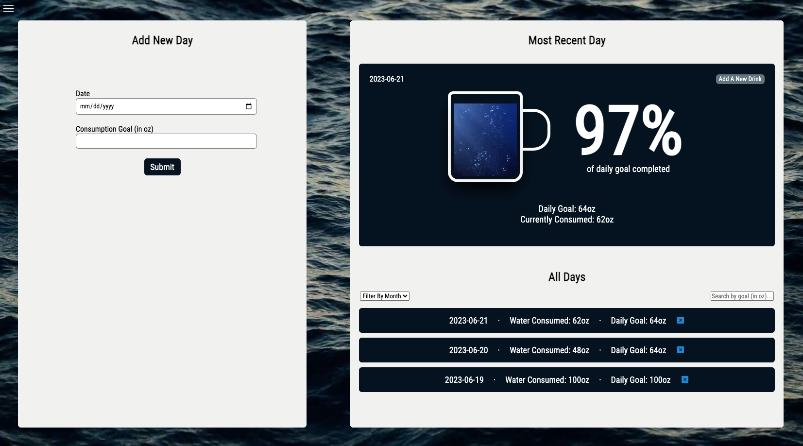

# Sip: A Water Tracking Hydration App

## Built With
This application was built with React.js, Python, Flask, and SQLAlchemy.

***

## Getting Started

### Run client (terminal 1): 
• cd into 'client'

• run npm install & npm start

• get an API key for https://www.weatherapi.com/ and add it to a .env file within 'client'

### Run server (terminal 2): 
• run pipenv install and pipenv shell

• cd into 'server'

• run python app.py

***

## About The App

Sip is a water hydration app that allows users to document and track their daily water intake. It provides users with water consumption information, and allows them to set and work towards achieving daily consumption goals.

***

## Contact
Sarah Jones - sarahrjones8@gmail.com - https://www.linkedin.com/in/srjones02/

Project Link: https://github.com/sarahjones016/phase-5-project-revised

Demo Video Link: https://bit.ly/sj-sip-demo

